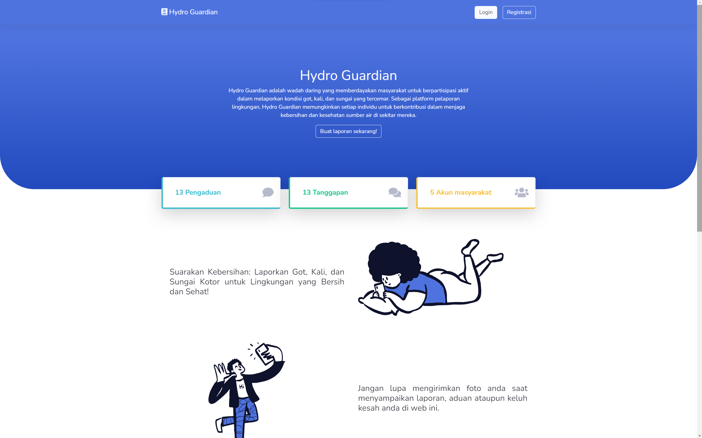
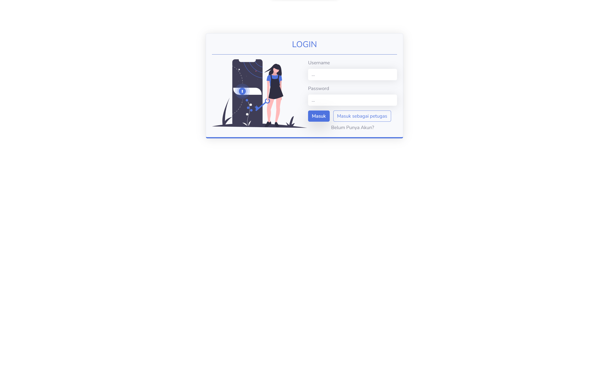
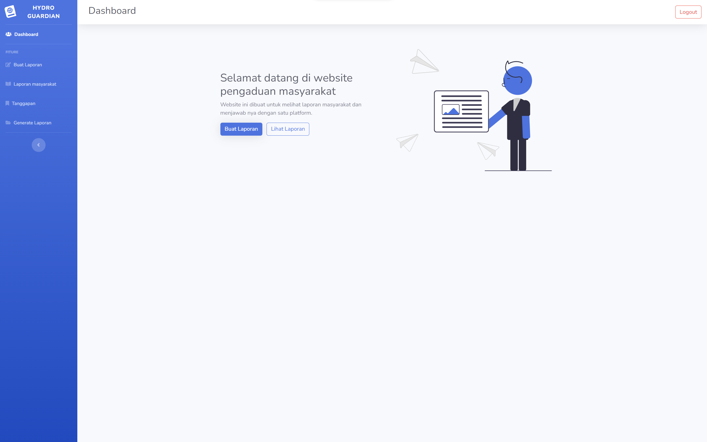

# Tugas Besar WAD
Hydro Guardian adalah wadah daring yang memberdayakan masyarakat untuk berpartisipasi aktif dalam melaporkan kondisi got, kali, dan sungai yang tercemar. Sebagai platform pelaporan lingkungan, Hydro Guardian memungkinkan setiap individu untuk berkontribusi dalam menjaga kebersihan dan kesehatan sumber air di sekitar mereka.

 
<h3>Display Website</h3>

 

- Landing pages

 

- Login

 

- Dashboard

